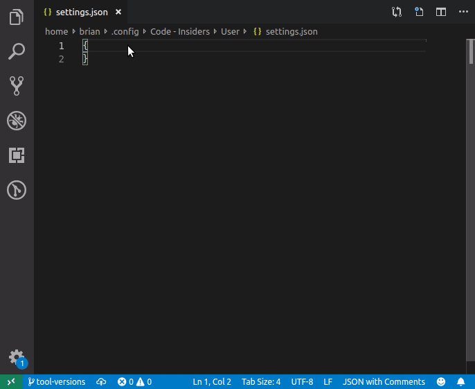

# Vimspired

[](https://marketplace.visualstudio.com/items?itemName=bmalehorn.vimspired)
[](https://marketplace.visualstudio.com/items?itemName=bmalehorn.vimspired)

Vimspired is an extension that makes it easy for you to write your own vim-like keybindings.



Here's a small example:

```json
"vimspired.keybindings": {
  "i": "vimspired.toggle",

  "w": "cursorUp",
  "a": "cursorLeft",
  "s": "cursorDown",
  "d": "cursorRight"
}
```

In this example,
you can press `i` to enter insert mode,
`wasd` to move around,
and finally `Escape` to return to normal mode.

Unlike vim modes, you start with a blank slate - get creative and make your very own key layout!

## Sample Config

Here's **my** layout, after a lot of use:

```json
{
  "vimspired.keybindings": {
    "1": null,
    "2": "editor.action.goToDeclaration",
    "@": "references-view.find",
    "3": "seito-openfile.openFileFromText",
    "#": "editor.action.openLink",
    "4": "removeSecondaryCursors",
    "5": {
      "selecting": "cursorTopSelect",
      "default": "cursorTop"
    },
    "6": "bookmarks.listFromAllFiles",
    "^": "bookmarks.toggle",
    "7": "workbench.action.navigateBack",
    "8": {
      "selecting": "cursorBottomSelect",
      "default": "cursorBottom"
    },
    "9": ["cursorHome", "extension.hungryDelete"],
    "0": "workbench.action.findInFiles",
    "-": "editor.action.dirtydiff.next",
    "=": "vimspired.swapActiveAndAnchor",
    "q": "editor.action.formatDocument",
    "Q": "tslint.fixAllProblems",
    "w": "editor.action.clipboardCutAction",
    "e": "extension.smartBackspace",
    "E": "extension.hungryDelete",
    "r": ["editor.action.insertLineAfter", "vimspired.enterInsert"],
    "t": "vimspired.toggleSelection",
    "y": "editor.action.wordHighlight.next",
    "Y": "editor.action.wordHighlight.prev",
    "u": "scrollViewport.scrollDown",
    "i": "scrollViewport.scrollUp",
    "o": {
      "selecting": ["cursorHomeSelect", "cursorHomeSelect"],
      "default": "cursorLineStart"
    },
    "O": {
      "selecting": "cursorHomeSelect",
      "default": "cursorHome"
    },
    "p": {
      "selecting": ["cursorEndSelect", "cursorEndSelect"],
      "default": "cursorLineEnd"
    },
    "[": "workbench.action.showCommands",
    "]": null,
    "\\": ["workbench.action.files.save", "workbench.action.closeActiveEditor"],
    "a": {
      "selecting": [
        "editor.action.clipboardCopyAction",
        "vimspired.cancelSelection"
      ],
      "default": [
        "editor.action.clipboardCopyAction",
        "cursorLineEnd",
        "cursorRight"
      ]
    },
    "s": "editor.action.clipboardPasteAction",
    "d": "deleteWordLeft",
    "f": "vimspired.enterInsert",
    "g": "editor.action.showHover",
    "h": {
      "1": "workbench.action.openSettingsJson",
      "2": "workbench.action.openSettings2",
      "8": "insertDateString.insertDate",
      "w": "editor.action.toggleRenderWhitespace",
      "e": "gitlens.openRepoInRemote",
      "r": "workbench.action.reloadWindow",
      "t": ["editor.fold", "editor.unfold"],
      "y": "rewrap.rewrapComment",
      "o": "gitlens.openCommitInRemote",
      "u": "emoji.indertEmoji",
      "p": "workbench.action.gotoLine",
      "a": [
        "cursorTop",
        "cursorBottomSelect",
        "editor.action.clipboardCopyAction",
        "cancelSelection"
      ],
      "F": "copyRelativeFilePath",
      "l": "gitlens.openFileInRemote",
      "x": "workbench.action.closeEditorsInOtherGroups",
      "b": "gitlens.toggleFileBlame",
      "m": ["workbench.action.splitEditor", "markdown.extension.togglePreview"],
      "s": "editor.action.sortLinesAscending",
      "n": "editor.action.rename"
    },
    "j": {
      "selecting": "cursorDownSelect",
      "default": "cursorDown"
    },
    "J": "editor.action.moveLinesDownAction",
    "k": {
      "selecting": "cursorUpSelect",
      "default": "cursorUp"
    },
    "K": "editor.action.moveLinesUpAction",
    "l": {
      "selecting": "cursorLeftSelect",
      "default": "cursorLeft"
    },
    ";": {
      "selecting": "cursorRightSelect",
      "default": "cursorRight"
    },
    "'": "editor.action.commentLine",
    "\"": [
      "editor.action.addCommentLine",
      "editor.action.copyLinesDownAction",
      "editor.action.removeCommentLine"
    ],
    "z": "editor.action.smartSelect.expand",
    "x": "vimspired.copyWord",
    "c": "editor.action.startFindReplaceAction",
    "v": "actions.find",
    "b": null,
    "n": "copyFilePath",
    "N": "copyRelativeFilePath",
    "m": {
      "selecting": "cursorWordStartLeftSelect",
      "default": "cursorWordStartLeft"
    },
    ",": {
      "selecting": "cursorWordEndRightSelect",
      "default": "cursorWordEndRight"
    },
    ".": "workbench.action.focusNextGroup",
    ">": "workbench.action.toggleEditorWidths",
    "/": "undo",
    "?": "redo",
    " ": "workbench.action.quickOpen"
  }
}
```

## Keybindings

The `vimspired.keybindings` object accepts a few different values for the keybindings.

### Single Command: `string`

```json
{
  "h": "cursorLeft"
}
```

This executes the VSCode command `cursorLeft`.
You can find a list of all commands by pressing `Ctrl-K Ctrl-S`.
For instance, I found this command because `LeftArrow` key is normally bound to `cursorLeft`.

### Sequence of Commands: `Action[]`

```json
{
  "o": ["editor.action.insertLineAfter", "vimspired.enterInsert"]
}
```

Executes the list of commands in sequence.

### Leader Key: `{ [key: string]: Action }`

```json
{
  "g": { "q": "rewrap.rewrapComment" }
}
```

Pressing `g q` will run the command `rewrap.rewrapComment`.

### Highlighting: `{selecting: Action, default: Action}`

```json
{
  "h": { "selecting": "cursorLeftSelect", "default": "cursorLeft" }
}
```

If text is highlighted, runs the first command.
Otherwise, runs the second command.

In the above example,
if you already highlighted text,
pressing `h` would move the cursor without canceling the selection.
This is the same behavior as `Shift + LeftArrow`.

### Command with Arguments: `{command: string, args: {}}`

```json
{
  "d": {
    "command": "editorScroll",
    "args": {
      "to": "down",
      "by": "line",
      "revealCursor": true,
      "value": 10
    }
  }
}
```

Run a single built-in command,
but with arguments.

A complete list of all VSCode built-in commands is available
[here](https://code.visualstudio.com/api/references/commands).

## Context variable

You can add `"when": "vimspired.normal"` to a regular keybinding to only have it apply when Vimspired is active.

```json
{
  "key": "ctrl+shift+i",
  "command": "editor.action.formatDocument",
  "when": "vimspired.normal"
}
```

Similarly, you can add `"when": "!vimspired.normal"` to have it apply when in insertion mode.

For more information on regular keybidings, see [Key Bindings for Visual Studio Code](https://code.visualstudio.com/docs/getstarted/keybindings).

## Similar Projects

- [ModalEdit](https://marketplace.visualstudio.com/items?itemName=johtela.vscode-modaledit): A fork of Vimspired, adding key repeat, JavaScript expressions, incremental search, bookmarks, and more. Includes a built-in Vim mode.
- [Dance](https://marketplace.visualstudio.com/items?itemName=gregoire.dance): A custom modal layout for VSCode, inspired by Kakoune.
- [Xah Fly Keys](http://ergoemacs.org/misc/ergoemacs_vi_mode.html): A custom modal layout for Emacs.
- [NieuMode](https://github.com/appledelhi/neiumode): A custom modal layout for VSCode, design for Colemak keyboard layout.
- [Kakoune](http://kakoune.org/): A custom modal editor for the command line, with strong multiple cursor support.
- [SimpleVim](https://marketplace.visualstudio.com/items?itemName=jpotterm.simple-vim): Vim-like modal editing for VSCode, prioritizing native VSCode features over Vim concepts.
